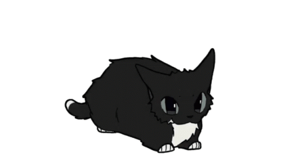

# Fluid Linux

> **Status:** Early-stage experimental project  
> **Name:** `Fluid Linux` is currently a working codename and may change later

Fluid Linux is an experimental Debian-based desktop Linux distribution for x86_64 systems. It aims to provide a clean Debian experience without the usual systemd-based setup.

The project plans to use **Finit**, or alternatively **Laked**, as its init system. It also offers pre-riced water/wave-themed desktop environments and window managers.

---

## Concept

| Area | Plan |
|---|---|
| Base | Debian-based |
| Architecture | x86_64 only |
| Target users | Intermediate Linux users |
| Init system | Finit or Laked |
| Default shell | `sh` |
| Alternative edition | Fish shell by default |
| libc | Musl libc |
| Theme | Water/wave-inspired rice |
| Documentation | Documentation-first, with focus on man pages |

---

## Key Features

- Debian-based desktop operating system.
- No systemd by default.
- Finit and Laked flavors.
- Planned Laked support as a first-class init option.
- Musl libc direction.
- Community-driven development.
- Pre-riced water/wave-themed desktops and window managers.
- Warnings before risky operations.
- Documentation-first approach with focus on man pages.

---

## Supported Desktops

Fluid Linux plans to support four graphical setups:

- KDE Plasma
- XFCE
- IceWM
- Xmonad

---

## Editions

### Main Edition

Uses `sh` as the default shell for a simple and portable base system.

### Fish Edition

Uses Fish as the default shell for a more interactive command-line experience.

---

## Documentation

Documentation is a main priority for Fluid Linux.

Planned documentation areas include:

- Installation guide
- Man pages
- Init system usage
- Desktop/window manager customization
- Troubleshooting

---

## Cat

Because every serious operating system needs a cat.

---

## License

Fluid Linux follows the same licensing direction as Debian. Individual packages may keep their original upstream licenses.
